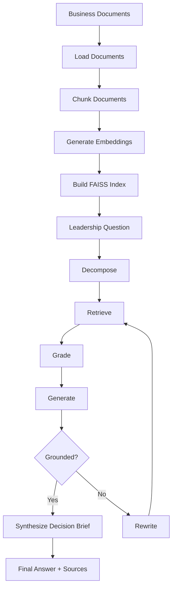

# AI Leadership Insight & Decision Agent

An AI-powered assistant for company leadership that answers questions about organizational performance using internal documents and handles open-ended strategic questions through autonomous research and decision-making.

## Problem Statement

Leadership teams often need fast, defensible answers to questions about business performance, strategic risk, and operational priorities. In practice, those answers are buried across quarterly earnings reports, annual filings, dashboards, and strategy documents. Manually reviewing those materials is slow, fragmented, and difficult to scale, while generic chatbots can produce answers that are not grounded in the source material.

This repository addresses that problem by building a document-grounded leadership assistant. It ingests internal business documents, indexes them for retrieval, decomposes broad strategic questions into targeted sub-questions, retrieves the most relevant evidence, checks whether the response is supported by the documents, and returns a structured answer with source-backed decision guidance.

In short, the system is designed to help leadership teams move from scattered documents to faster, evidence-based decisions.

## Architecture

The system follows a retrieval-augmented pipeline over internal business documents. Documents are loaded, chunked, embedded, stored in FAISS, and then used by a 7-node question-answering workflow defined in `src/agent/pipeline.py`.



This gives the project two clear stages:

1. Document processing: load files, split them into chunks, create embeddings, and persist the FAISS index.
2. Question answering: retrieve evidence, filter it, generate an answer, check grounding, and produce a decision brief.

**Nodes:**
| Node | Purpose |
|------|---------|
| **Decompose** | Uses the LLM to decide whether the input should stay as one question or be split into up to 4 focused sub-questions |
| **Retrieve** | Embeds each sub-question, runs FAISS similarity search, and deduplicates chunks by content |
| **Grade** | Sends retrieved chunks to the LLM in one batch and keeps only the chunks judged relevant |
| **Generate** | Produces a factual answer grounded only in the filtered document context |
| **Hallucination Check** | Asks the LLM whether the generated answer is supported by the retrieved source chunks |
| **Rewrite** | Rewrites the question to improve retrieval when the answer is not sufficiently grounded |
| **Synthesize** | Produces a final decision brief with situation summary, findings, risks, and recommendation |

**Execution notes:**
- Maximum rewrite loops: `2`
- Retrieval depth per sub-question: `TOP_K = 5`
- Fallback after grading: top `TOP_N = 3` chunks by relevance score when all chunks are filtered out

## Tech Stack

- **Python 3.13**
- **LangChain** + **LangGraph** — document processing, embeddings, agentic graph
- **FAISS** — local vector store for similarity search
- **Azure OpenAI** — GPT-4.1 (LLM) + text-embedding-3-small (embeddings)
- **Streamlit** — chat UI with document management

## Project Structure

```
ai-leadership-agent-adobe/
├── app.py                          # Streamlit chat app and document upload UI
├── build_index.py                  # Loads docs, chunks them, and builds the FAISS index
├── rebuild_and_test.py             # Rebuilds the index and runs one end-to-end smoke test
├── test_all_questions.py           # Runs a small batch of example leadership questions
├── config.py                       # Azure, chunking, retrieval, and path configuration
├── requirements.txt
├── .env.example                    # Environment variable template
├── data/
│   └── documents/                  # Source business documents used for retrieval
├── faiss_index/                    # Persisted FAISS index files
└── src/
   ├── ingestion/
   │   ├── loader.py               # Loads PDF, DOC, DOCX, TXT, CSV, XLS, XLSX, PPTX files
   │   └── chunker.py              # Recursive character chunking with overlap
   ├── vectorstore/
   │   └── store.py                # Embedding model setup and FAISS create/load/update helpers
   ├── retrieval/
   │   └── retriever.py            # Simple retrieval helpers for similarity search
   ├── generation/
   │   └── generator.py            # Azure OpenAI chat and embedding REST helpers
   └── agent/
      └── pipeline.py             # 7-node agent pipeline and end-to-end runner
```

## Setup

1. **Install dependencies:**
   ```bash
   pip install -r requirements.txt
   ```

2. **Configure environment:**
   ```bash
   copy .env.example .env
   ```
   Edit `.env` with your Azure OpenAI credentials:
   ```
   AZURE_OPENAI_ENDPOINT=https://your-resource.openai.azure.com
   AZURE_OPENAI_KEY=your-api-key
   ```

3. **Add documents:**
   Place company documents in `data/documents/`.

   Supported file types in the current loader implementation:
   - PDF
   - DOC and DOCX
   - TXT
   - CSV
   - XLS and XLSX
   - PPTX

4. **Build the vector index:**
   ```bash
   python build_index.py
   ```

5. **Run the app:**
   ```bash
   streamlit run app.py
   ```

## Chunking Strategy

The current implementation uses **recursive character chunking**, not semantic or section-aware chunking.

- Implemented with `RecursiveCharacterTextSplitter`
- Default chunk size: `1000` characters
- Default overlap: `200` characters
- Separator priority: paragraph breaks, line breaks, sentence boundaries, spaces, then raw character fallback
- Metadata from the original document is preserved on each chunk

This means the splitter prefers natural text boundaries when possible, but falls back to smaller units to ensure large documents are broken into retrieval-friendly chunks.

## Usage

### Streamlit UI
- Upload documents via sidebar
- Build/rebuild index with one click
- Ask questions in the chat interface
- View decision brief, source citations, and agent trace

### Example Questions
- *"What is our current revenue trend?"*
- *"Which departments are underperforming?"*
- *"What were the key risks highlighted in the last quarter?"*
- *"Should we increase investment in the India market?"*
- *"What is our biggest competitive vulnerability?"*

## Configuration

Key parameters in `config.py`:

| Parameter | Default | Description |
|-----------|---------|-------------|
| `LLM_DEPLOYMENT` | `gpt-4.1` | Azure OpenAI chat model |
| `EMBEDDING_DEPLOYMENT` | `text-embedding-3-small` | Embedding model |
| `CHUNK_SIZE` | `1000` | Max characters per chunk |
| `CHUNK_OVERLAP` | `200` | Overlap between chunks |
| `TOP_K` | `5` | Chunks retrieved per sub-query |
| `TOP_N` | `3` | Chunks kept after re-ranking |
